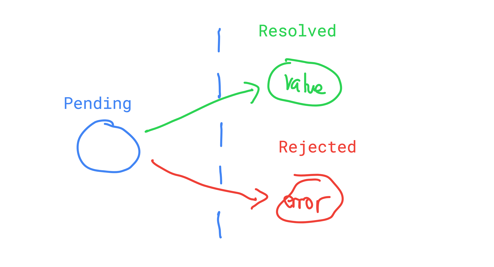

# Errors and Promises

[Git Crackin'](https://github.com/JoelCodes/Promises-Lecture-22-Jun-2017)

## Errors

Errors are a great way of breaking your app when something messes up. Usually, when we talk about errors, we're talking about the `throw` keyword.  It's like `return` in that it stops the operation of a function, but `return` will only stop the *nearest* function. In the following example:

```js
function outer(){
  function inner(){
    return;
    console.log('Inner Stuff'); // Won't Run
  }

  // Outer Function Execution
  inner();
  console.log('Outer Stuff');  // Will Run
}

outer();
```

The early `return` on `inner()` prevents the `console.log('Inner Stuff');` from firing, but not the `console.log('Outer Stuff');`.  But `throw` will cause a break of all the functions until it reaches the end of the program or it's caught.

```js
function outer(){
  function inner(){
    throw new Error('Kaboom!');
    console.log('Inner Stuff'); // Won't Run
  }

  // Outer Function Execution
  inner(); // Throws an error
  console.log('Outer Stuff'); // Won't run either
}

outer();  // Throws an error

console.log('After Outer'); // Won't Run

```

Basically, this will cause the entire app to end early.  We can, however, wrap the dangerous function in a `try`-`catch` block, and then the error will stop propagating.

```js
function outer(){
  function inner(){
    throw new Error('Kaboom!');
    console.log('Inner Stuff'); // Won't Run
  }

  // Outer Function Execution
  inner(); // Throws an error
  console.log('Outer Stuff'); // Won't run either
}

try{
  outer();  // Throws an error
} catch(err){
  console.log('There was a problem: ', err.message); // There was a problem: Kaboom!
}

console.log('After Outer'); // Runs
```

### Designing functions with errors

When we created our `sum` function in week 1, we didn't really have to think about error handling.  Basically, if someone put in a number, we added it: if someone put in something that wasn't a number, we ignored it.  If all else fails, add zero or return zero.  It was pretty chill.  Today, we had an `average` function, but that can't be as chill. We need to have informative input.  We designed our `average` function to fail informatively if someone put in empty values or non-informative values:

```js
function average(nums){
  // If there is no good input, go no further.  
  if(!nums || !nums.length){
    throw new Error('Invalid Input');
  }

  const sum = nums.reduce((running, number) => {
    if(isNaN(number)) {
      throw new Error('Invalid Entry: ' + number);
    }
    return running + Number(number);
  });
  return sum / nums.length;
}
```

On our server side, if we just call this and there's an error, it will result in a 500.


But we want to let the user know that they have bad input, so we should send a 400 and an informative message.


```js
app.post('/', (req, res) => {
  try{
    const mean = average(req.body.nums.split(', '));
    res.render('index', {
      nums: req.body.nums,
      success: 'Your average is ' + mean
    });
  } catch(error){
    res.status(400) // Input Error
      .render('index', {
        nums: req.body.nums,
        error: error.message
      });
  }
});
```

Now you're giving your user a more informative message, and telling them what to fix.

## Promises

These errors are great, but they're also synchronous only.  Lets do a callback version of average:

```js
const averageWithCallback(nums, cb){
  try {
    cb(undefined, average(nums));
  } catch(error) {
    cb(error);
  }
}
```

Now our server logic can be asynchronous

```js
app.post('/', (req, res) => {
  averageWithCallback(req.body.nums.split(', '), (error, mean) => {
    if(error){
      res.status(400) // Input Error
        .render('index', {
          nums: req.body.nums,
          error: error.message
        });
    } else {
      res.render('index', {
        nums: req.body.nums,
        success: 'Your average is ' + mean
      });
    }
  });
});
```

But there's a mechanism called Promises that we want to use.  Promises are simple state machines with three states: Pending, Resolved, and Rejected.  They always start with Pending, and then may go to Resolved or Rejected.  Once in either of those final states, they can't go to any other state.  They may have a payload of data in the final state.



Here's the promise version of `average`:

```js
function averageWithPromise(nums){
  try{
    return Promise.resolve(average(nums));
  } catch(error){
    return Promise.reject(error);
  }
}
```

And our server code follows:

```js
app.post('/', (req, res) => {
  averageWithPromise(req.body.nums.split(', '))
    .then((mean) => {
      res.render('index', {
        nums: req.body.nums,
        success: 'Your average is ' + mean
      });
    })
    .catch((error) => {
      res.status(400) // Input Error
        .render('index', {
          nums: req.body.nums,
          error: error.message
        });
    });
});
```

But is that all we get?  We got a different callback convention?  Two callbacks for the price of one?  Can't there be more?

### Composition

The cool thing about Promises that set them apart from mere callbacks is that they're composable.  Callbacks are just about doing things, and if you want to combine many async operations, it just means nested callbacks.  If you want to run many operations in sequence and do something when they all finish, that can be really complicated.  It's a lot easier with promises.

The `.then` and `.catch` functions seem exactly like callbacks at first glance.  If this were about arrays, it would be like `.forEach`.  `.forEach` just gives us access to each item in turn, after all, and lets us perform some side effect like updating the DOM, or returning an HTTP response.  But `.then` also performs like `.map`.  Just like `.map` lets us take an array of one type, pass in a transformer function, and get out an array of a new type, `.then` and `.catch` let us pass in a transformer function and get a new promise that resolves (or rejects) with a new value.

```js
// returns a promise that resolves with an array of students
function getAllStudents(){ 
  return Promise.resolve([
    {name: 'Joel', grade: 57},
    {name: 'Tian', grade: 95},
    {name: 'Colin', grade: 82}
  ]);
}

function getStudentNamesAboveGrade(grade){
  return getAllStudents()
    .then(allStudents => {
      return allStudents
        .filter(student => student.grade >= grade)
        .map(student => student.name);
    });
}

getStudentNamesAboveGrade(60)
  .then(studentNamesAbove60 => {
    console.log(studentNamesAbove60); // ['Tian', 'Colin']
  });
```

One thing I like to do with this is create a delay promise that just waits 2000 ms to resolve, then chain that with a value.  Then I can use dummy data to create a fake API that behaves exactly like my real API, but with enough of a delay that I can see the loading icon.

```js

const fakeData = [{id: 1, name: 'Aishwarya'}, {id: 2, name: 'Ti'}];

const delay = () => new Promise((resolve) => {
  setTimeout(resolve, 2000);
});

const getAll(){
  return delay()
    .then(() => {
      return fakeData;
    });
}

const getSingle(id){
  const found = fakeData.find(user => user.id === id);
  return delay()
    .then(() => {
      if(found) { 
        return Promise.resolve(found);
      }
      return Promise.reject(new Error('User Not Found!'));
    });
}


module.exports = {
  getAll,
  getSingle,
}
```

The last cool thing about `.then` and `.catch` is that if the transformer function returns a promise, then our new promise will resolve or reject with the new promise's value.  If I have two calls that are meant to be sent one after the other (like getting an API request and saving it to local storage).

```js
const getFromAPI(id){
  return Promise.resolve({id, content: 'This is a fake thing!'})
}

const saveToLocalStorage(id, item){
  return Promise.resolve(item);
}

const getAndSave(id){
  return getFromAPI(id)
    .then((item) => {
      return saveToLocalStorage(id, item);
    });
}
```

The last big tool is Promise.all.  One common problem that promises solve is having to wait for many promises to finish.  Promise.all lets you arrange your disparate promises into an array, then it resolves only when all the promises have resolved.

```js
const userPromise = getUser(); // returns user object
const eventsPromise = getEvents(); // returns array of events

const combinedPromise = Promise.all([userPromise, eventsPromise]);

combinedPromise
  .then(results => {
    console.log(results); // [{user object}, [events array]];
  })
```

In this case, I love the array destructuring.  Yay ES6!

```js
combinedPromise
  .then(([users, events]) => {
    console.log(users, events); // {user object}, [events array];
  })
```

I can also use this to do batch operations.  Imagine that I have a bunch of article ids, and I want to fetch their articles from an API.  I can map the ids into an array of Promises each of which return a single article.

```js
// ([articleId]) => Promise<[Article]>
function getArticles(articleIds){
  // [Promise<Article>]
  const articlePromises = articleIds.map(articleId => {
    return getArticle(articleId);
  });
}
```

Then I can use Promise.all to basically move the last "s".  It goes from an Array of Promises that each resolve with an Article to a Promise that resolves with an Array of Articles.

```js
// ([articleId]) => Promise<[Article]>
function getArticles(articleIds){
  // [Promise<Article>]
  const articlePromises = articleIds.map(articleId => {
    return getArticle(articleId);
  });

  // Promise<[Article]>
  const articlesPromise = Promise.all(articlePromises);
  return articlesPromise;
}
```
